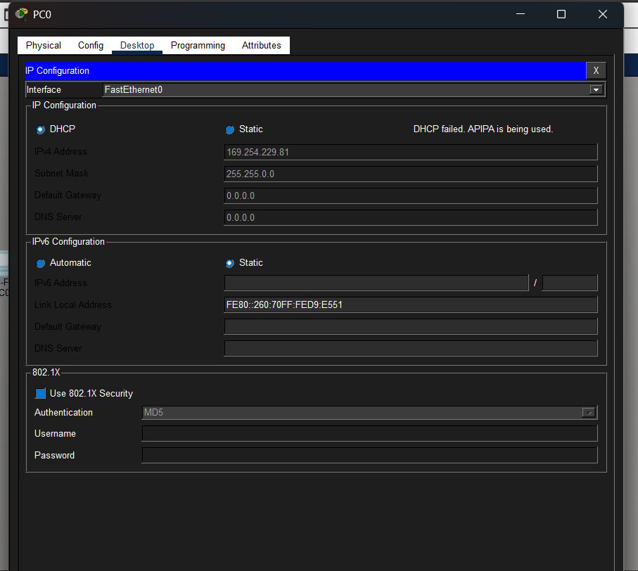

 # DHCP Troubleshooting Lab – Small Office Network (Cisco Packet Tracer)

## 📌 Project Overview
This project simulates a small office network built using :contentReference[oaicite:0]{index=0}. The network consists of a router, two switches, and six PCs. The main objective was to create and troubleshoot a DHCP failure scenario and restore network connectivity.

---

## 🖧 Network Topology
The network includes:
- 1 × Router (2911)
- 2 × Switches (2960)
- 6 × PCs connected via Ethernet

The router was configured to provide DHCP services to all connected devices on the LAN.

---

## ⚠️ Problem Identified (DHCP Failure)

When testing connectivity, PC0 failed to receive an IP address from the DHCP server.

## 📸 DHCP Failure

Using Command Prompt on PC0:
- Command used: `ipconfig`

### Result:
- IP Address: `169.254.229.81` (APIPA address)
- Subnet Mask: Automatically assigned
- Default Gateway: `0.0.0.0`

### Interpretation:
This confirmed that the PC failed to obtain a DHCP lease and automatically assigned itself an APIPA address.

---

## 🔍 Troubleshooting Process

To investigate the issue:
1. Selected **PC0**
2. Navigated to **Desktop → Command Prompt**
3. Ran the command:
   - `ipconfig`
4. Confirmed DHCP failure from APIPA result
5. Captured diagnostic evidence

- Screenshot: `09-dhcp-diagnosis.png`

---

## 🛠️ Fix / Resolution Steps

To restore DHCP functionality:

1. Accessed the router configuration environment
2. Recreated the DHCP pool for the LAN network:
   - DHCP Pool Name: `LAN_A`
   - Network Address: `192.168.10.0`
   - Subnet Mask: `255.255.255.0`
   - Default Gateway: `192.168.10.1`
   - DNS Server: `8.8.8.8`

3. Saved and applied configuration
4. Returned to PC0 and renewed DHCP lease via:
   - Desktop → IP Configuration → DHCP

---

## ✅ Final Verification

After fixing the DHCP configuration, PC0 successfully received a valid IP address.

### Result:
- IP Address: `192.168.10.2`
- Subnet Mask: `255.255.255.0`
- Default Gateway: `192.168.10.1`

- Screenshot: `10-dhcp-success.png`

---

## 📚 Key Skills Demonstrated
- DHCP configuration and troubleshooting
- IP addressing (IPv4 fundamentals)
- Network diagnostics using `ipconfig`
- Router configuration in Cisco Packet Tracer
- Problem-solving in LAN environments
- Basic network administration

---

## 📸 Screenshots
Placed all screenshots in a `/screenshots` folder:
- 08-dhcp-failure.png
- 09-dhcp-diagnosis.png
- 10-dhcp-success.png

---

## 🚀 Outcome
The DHCP issue was successfully diagnosed and resolved, restoring automatic IP assignment across the network and ensuring proper LAN communication.

---

